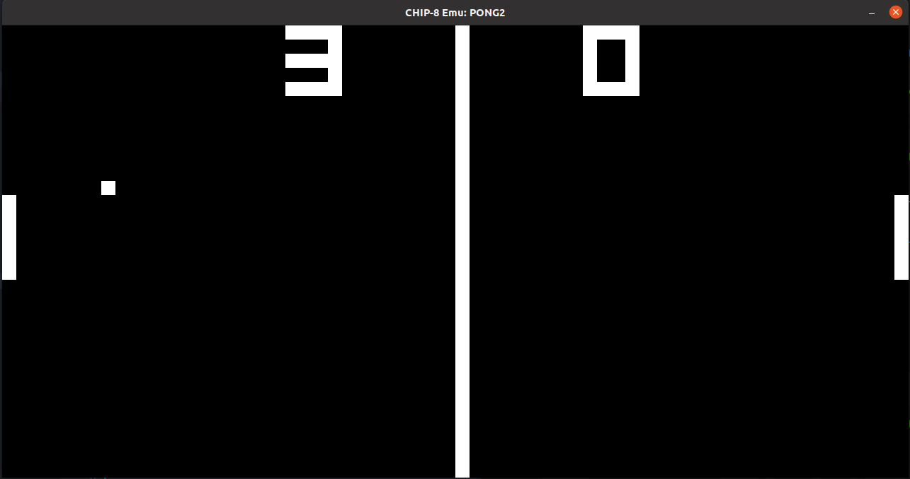
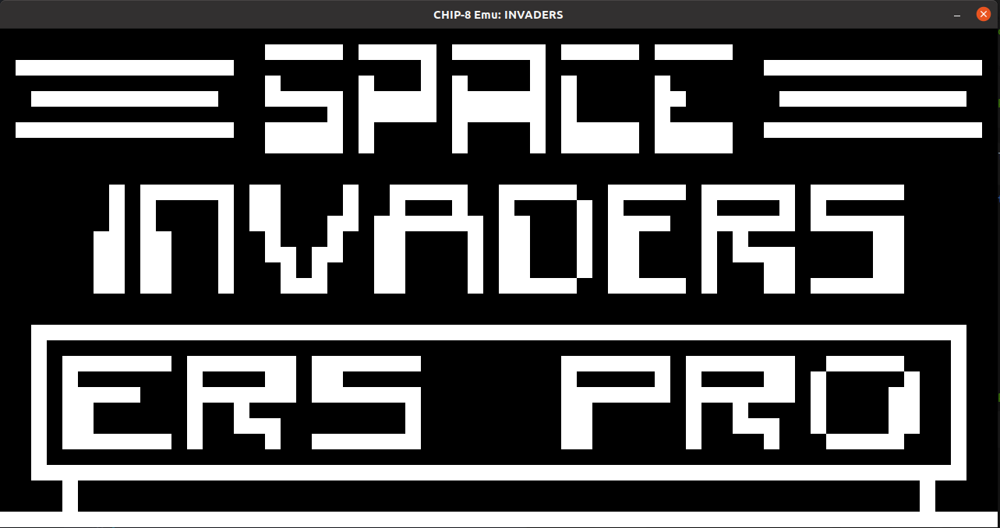
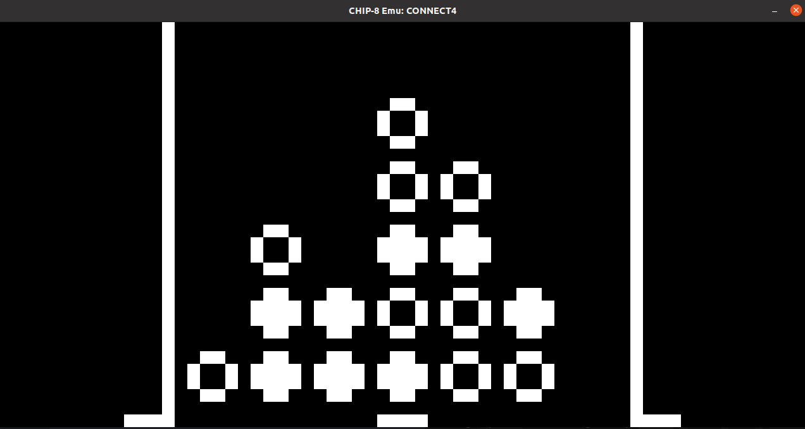
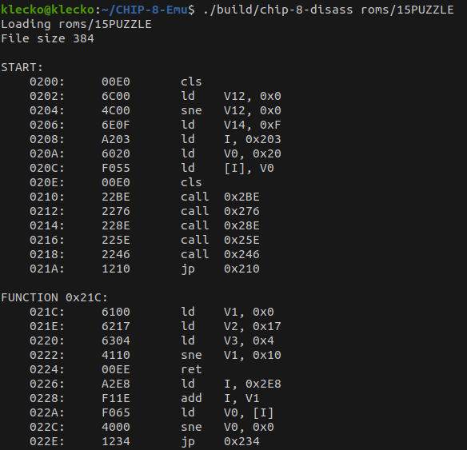

# CHIP-8-Emu
CHIP-8-Emu is an emulator for CHIP-8, an interpreted language from the 1970s. It supports many games such as Pong, Tetris, Space Invaders or Pac-Man.

Although it is C++, it is basically written as C with objects. Display, input detection and sound is based in SDL.

**PONG**


**SPACE INVADERS**


**CONNECT4**


## Disassembler
Appart from the emulator, a simple disassembler is also included.



## Build
```
mkdir build
cd build
cmake ..
make
```

## Usage
```
./build/chip-8-emu <rom-file>
./build/chip-8-disass <rom-file>
```

## Roms
This repository includes a pack of public domain CHIP-8 roms. Source [here](https://www.zophar.net/pdroms/chip8/chip-8-games-pack.html).

## References
- http://www.cs.columbia.edu/~sedwards/classes/2016/4840-spring/designs/Chip8.pdf

- http://devernay.free.fr/hacks/chip8/C8TECH10.HTM

- https://en.wikipedia.org/wiki/CHIP-8